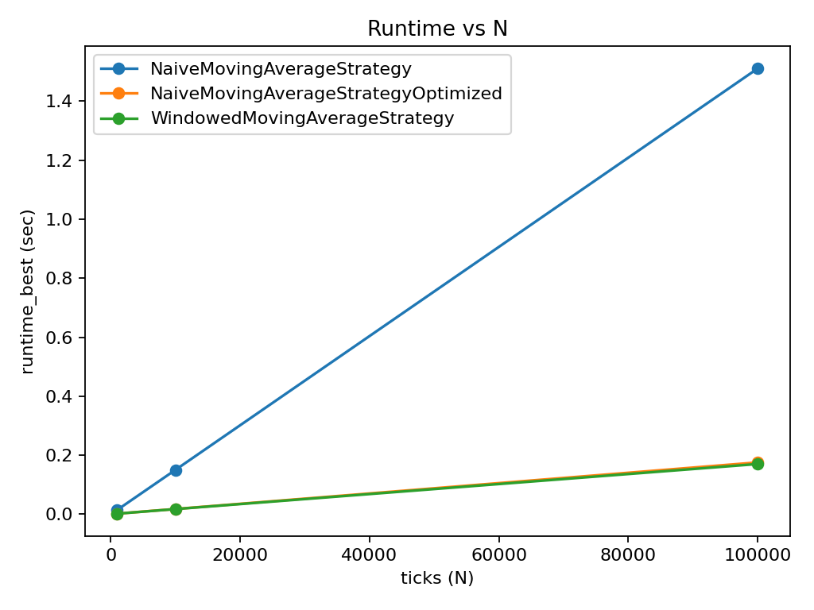
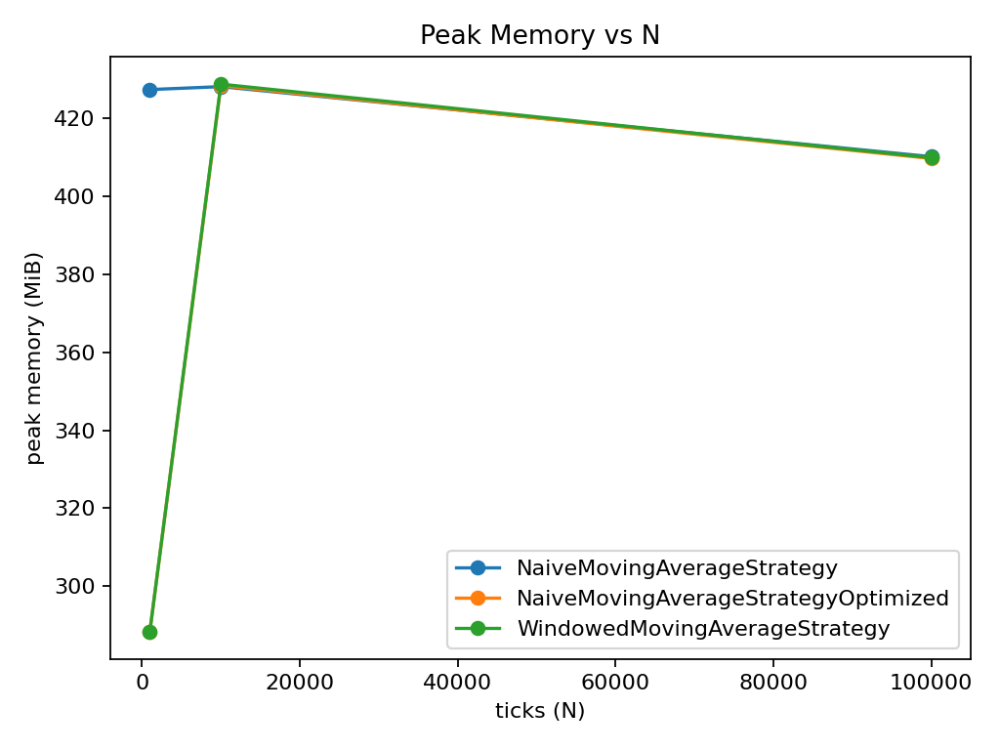

# Complexity and Performance Report

## Complexity Annotations
| Strategy | Complexity |
|---|---|
| NaiveMovingAverageStrategy | time=O(L) per tick, space=O(n) |
| NaiveMovingAverageStrategyOptimized | time=O(1) per tick, space=O(L) |
| WindowedMovingAverageStrategy | time=O(1) per tick, space=O(L) |

## Runtime Metrics
|strategy|N|runtime_best_sec|runtime_avg_sec|
|---|---|---|---|
|NaiveMovingAverageStrategy|1000|0.014423958025872707|0.014576041721738875|
|NaiveMovingAverageStrategy|10000|0.15018483297899365|0.1526080276040981|
|NaiveMovingAverageStrategy|100000|1.5111466250382364|1.5314304863568395|
|NaiveMovingAverageStrategyOptimized|1000|0.001807625056244433|0.0018678333532686036|
|NaiveMovingAverageStrategyOptimized|10000|0.017574875033460557|0.017611389358838398|
|NaiveMovingAverageStrategyOptimized|100000|0.175506875035353|0.17655120801646262|
|WindowedMovingAverageStrategy|1000|0.001705167000181973|0.0017172500180701415|
|WindowedMovingAverageStrategy|10000|0.01727762504015118|0.01733729165668289|
|WindowedMovingAverageStrategy|100000|0.1700950840022415|0.1705196249919633|

## Memory Metrics
|strategy|N|memory_peak_MiB|
|---|---|---|
|NaiveMovingAverageStrategy|1000|427.421875|
|NaiveMovingAverageStrategy|10000|428.171875|
|NaiveMovingAverageStrategy|100000|410.203125|
|NaiveMovingAverageStrategyOptimized|1000|288.34375|
|NaiveMovingAverageStrategyOptimized|10000|428.4375|
|NaiveMovingAverageStrategyOptimized|100000|409.734375|
|WindowedMovingAverageStrategy|1000|288.34375|
|WindowedMovingAverageStrategy|10000|428.8125|
|WindowedMovingAverageStrategy|100000|409.9375|

## Plots

## Narrative
Comparison at N = 100000
- Optimized vs Naive runtime: x8.61 faster (best).
- Windowed vs Naive runtime: x8.88 faster (best).
- Optimized memory vs Naive: 0.1% lower (peak).
- Windowed memory vs Naive: 0.1% lower (peak).
- Scaling: optimized/windowed ~O(1) per tick; naive grows with long_window.
