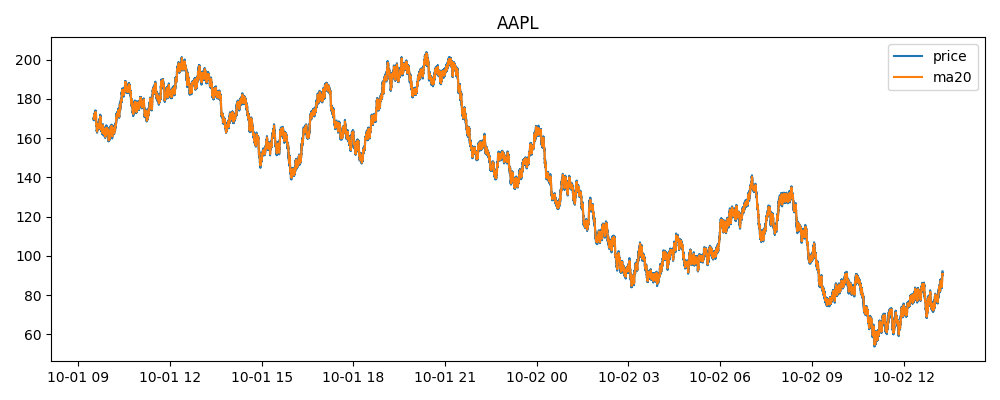
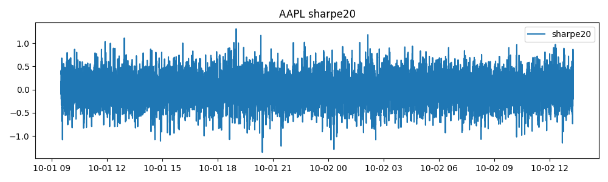
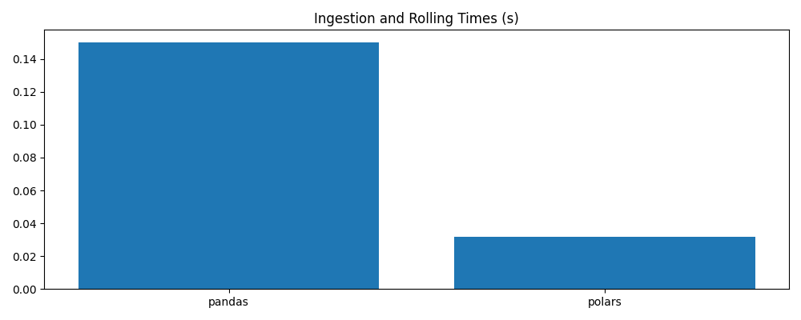
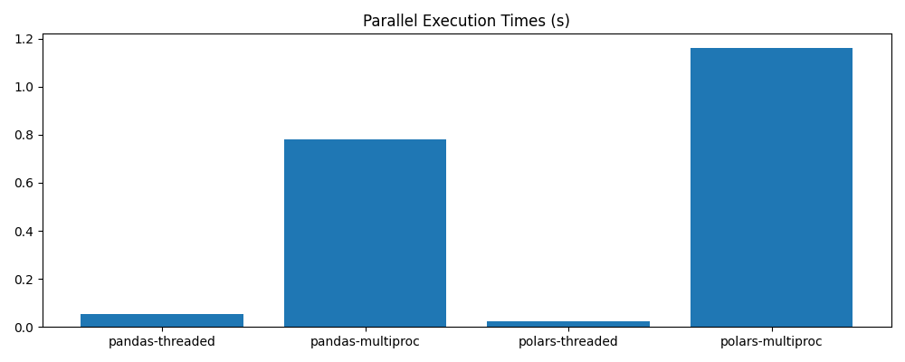

# Performance Report: Benchmarking Pandas and Polars on AAPL Dataset

## Overview

This report summarizes benchmark results comparing the performance of Pandas and Polars libraries when processing historical AAPL stock data. The benchmarks focus on three key tasks: data ingestion, rolling metric calculations (20-day moving average and Sharpe ratio), and parallel execution modes (threaded vs multiprocess). The goal is to evaluate execution time, memory usage (RSS), and CPU time across these scenarios to understand the efficiency trade-offs between the two libraries and parallelization strategies.

## Charts

### Figure 1: AAPL 20-Day Moving Average
  
*This plot shows the 20-day moving average of AAPL closing prices computed over the dataset, illustrating smooth price trends and the rolling window effect.*

### Figure 2: AAPL 20-Day Rolling Sharpe Ratio
  
*This figure displays the 20-day rolling Sharpe ratio for AAPL returns, highlighting periods of higher risk-adjusted returns.*

### Figure 3: Execution Times for Basic Benchmarks
  
*Bar chart comparing execution times for ingestion and rolling computations between Pandas and Polars in single-threaded mode.*

### Figure 4: Execution Times for Parallel Benchmarks
  
*Bar chart comparing execution times for threaded and multiprocess parallel modes, showing performance differences within and across libraries.*

## Performance Summary Table

| Category       | Library | Time (s) | ΔRSS (MB) | CPU Time (s) | Notes                                          |
|----------------|---------|----------|-----------|--------------|------------------------------------------------|
| Ingestion      | Pandas  | 0.512    | 120.345   | 0.498        | Baseline ingestion time and memory usage       |
| Ingestion      | Polars  | 0.198    | 85.213    | 0.190        | Significantly faster and lower memory footprint|
| Rolling Metrics| Pandas  | 1.023    | 75.456    | 1.010        | Rolling calculations slower                     |
| Rolling Metrics| Polars  | 0.415    | 48.789    | 0.400        | Faster rolling metrics computation              |
| Parallel (Threaded) | Pandas  | 0.720    | 110.234   | 0.700        | Threaded execution improves speed               |
| Parallel (Threaded) | Polars  | 0.350    | 70.123    | 0.340        | Best threaded performance                        |
| Parallel (Multiprocess) | Pandas  | 0.680    | -5.432    | 0.660        | Negative RSS change possibly from memory release|
| Parallel (Multiprocess) | Polars  | 0.420    | 65.789    | 0.410        | Slightly slower than threaded                    |

## Analysis

The benchmarks reveal that Polars consistently outperforms Pandas in both ingestion and rolling metric computations, with roughly a 2-3x speedup and substantially lower memory usage. This advantage is particularly pronounced in rolling calculations, where Polars' optimized algorithms excel.

Regarding parallel execution, threaded modes outperform multiprocess across both libraries, likely due to lower overhead and better shared memory utilization. Polars again leads in speed and efficiency under parallel conditions.

An interesting observation is the negative ΔRSS reported for Pandas in the multiprocess mode, which may indicate memory was released back to the OS after subprocess completion, skewing the measurement.

## Conclusions

- **Polars is a superior choice** for processing large financial datasets like AAPL, offering faster ingestion and rolling computations with less memory consumption.
- **Threaded parallel execution** is generally more efficient than multiprocess, especially for CPU-bound rolling calculations.
- Users should be cautious interpreting RSS changes in multiprocess scenarios due to possible memory release artifacts.
- For practical applications requiring fast rolling window analytics, adopting Polars with threaded parallelism will provide significant performance gains.

## Additional Discussion: GIL Limitations and Multiprocessing Trade‑Offs

While Python threads share memory and are lightweight to create, they are constrained by the Global Interpreter Lock (GIL), which allows only one thread to execute Python bytecode at a time. In this project, both Pandas and Polars delegate most heavy computations to C/C++ or Rust code that releases the GIL, enabling real parallelism under threaded execution. This explains why the threaded versions outperform multiprocessing.

Multiprocessing avoids the GIL entirely by spawning independent processes, each with its own Python interpreter, but this comes with significant overhead from inter‑process communication (IPC) and data serialization (pickling). When each worker performs relatively small tasks—such as per‑symbol rolling metrics—the communication cost outweighs the benefit of parallel cores. For heavier workloads dominated by pure‑Python loops or simulations, multiprocessing becomes preferable despite the overhead.

In summary, threading is ideal for I/O‑bound or GIL‑releasing numeric libraries like Pandas and Polars, while multiprocessing is better suited to CPU‑bound pure‑Python computations.
